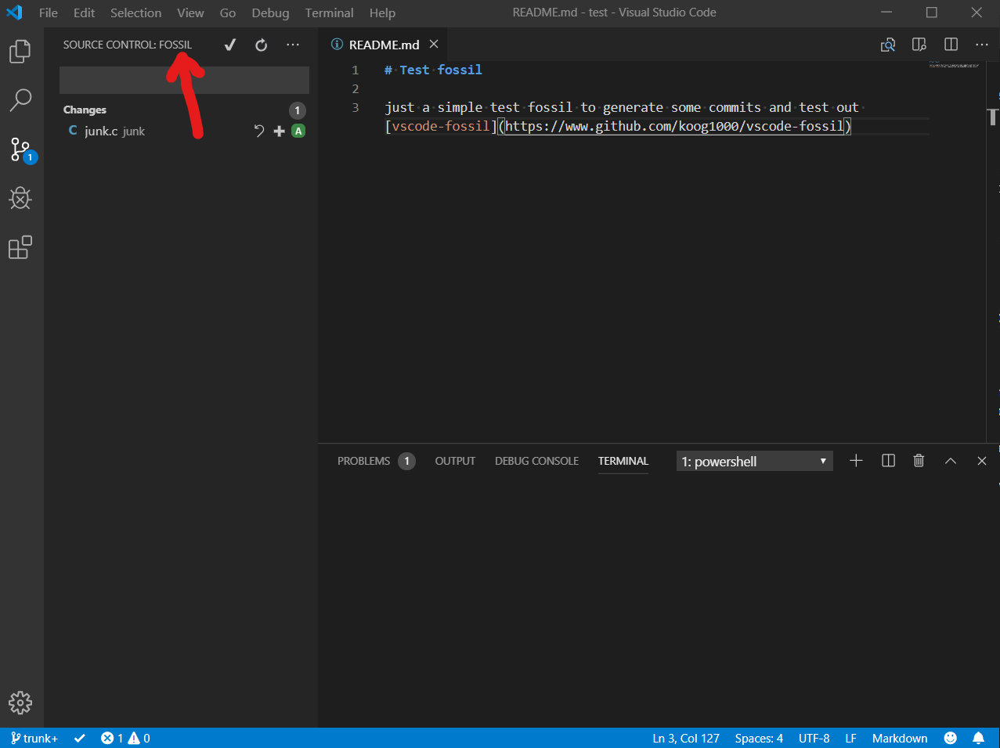

# Overview

## EdgeS™ integrated `afm-scm` source control

### Prerequisites

> This extension leverages your machine's `afm` installation,
so you need to
[install afm-scm](https://www.afm-scm.org/fossil/doc/trunk/www/quickstart.wiki)
first. Also read the [cloning](docs/cloning.md) documentation for info
about cloning from the extension.

## WORK IN PROGRESS. PLEASE SUBMIT [ISSUES](https://github.com/Smallscript-Corp/vscode-afm-scm/issues) IF YOU FIND THEM.

-----

# Features

* Add files and commit from the source control side-bar
  (i.e. where git normally appears).

* All the basics: commit, add, revert, update, push and pull.

* See changes inline within text editor.

* Interactive log for basic file history and diff.

* Branch, merge, resolve files.

* Quickly switch branches, push and pull via status bar.

* Supports named-branches workflows.

* Automatic incoming/outgoing counters.

* Undo

## View file changes

  * right click file and select `Open Changes`

## Initialize a new repo

__TODO__: update gif for afm

  * Just click the Afm icon from the source control title area
    * Follow prompts

## Update to a branch/tag

  * The current branch name is shown in the bottom-left corner.
  * Click it to see a list of branches and tags that you can update to.

# Settings

`afm.enabled { boolean }`

  * Enables Afm as a source control manager in VS Code.

`afm.autoUpdate { boolean }`

  * Enables automatic update of working directory to branch head after
  pulling (equivalent to `afm update`)
  *  `"true"` &mdash; enabled
  *  `"false"` &mdash; disabled, manual update/merge required

`afm.autoRefresh { boolean }`

  * Enables automatic refreshing of Source Control tab and badge counter
  when files within the project change:
  `"true"` &mdash; enabled
  `"false"` &mdash; disabled, manual refresh still available.

`afm.path { string / null }`

  * Specifies an explicit `afm` file path to use.
  * This should only be used if `afm` cannot be found automatically.
  * The default behaviour is to search for `afm` in commonly-known
    install locations and on the PATH.

# Troubleshooting

In general, Afm designers maintain an abundance of
[documentation](https://afm-scm.org/home/doc/trunk/www/permutedindex.html).
Reference that documentation as much as possible.

| Issue | Resolution
--------|----------------------------------------------------------------
| Unknown certificate authority | Read the [Afm SSL Documentation](https://afm-scm.org/home/doc/trunk/www/ssl.wiki#certs) to update fossil with the correct CA |
| inputBox prompt difficult to read | Run the same afm command on the built-in terminal (<code>Ctrl+`</code>). Unfortunately VS Code strips newlines and tabs from inputBox prompts. |

# Feedback & Contributing

* Please report any bugs, suggestions or documentation requests via the
[Github issues](https://github.com/Smallscript-Corp/vscode-afm-scm/issues)
(_yes_, I see the irony).
* Feel free to submit
[pull requests](https://github.com/Smallscript-Corp/vscode-afm-scm/pulls).

# Building Extension from Source
**Note:** The official way to install vscode-afm is from within
[VSCode Extensions](https://code.visualstudio.com/docs/editor/extension-gallery#_browse-for-extensions)

### Dependencies
You will need to install [Node.js](https://nodejs.org/en/download/)
on your computer and add it to your `$PATH`.

### Build Steps
1. `git clone` repository and place it in your VSCode extension folder (~/.vscode/extensions/ or similar).
2. `npm install` from clone directory to install local dependencies
3. `npm run compile` to build extension.

# Acknowledgements

[David Simmons](https://github.com/smallscript),[Ben Crowl](https://github.com/mrcrowl),
[ajansveld](https://github.com/ajansveld), [hoffmael](https://github.com/hoffmael), [nioh-wiki](https://github.com/nioh-wiki), [joaomoreno](https://github.com/joaomoreno), [nsgundy](https://github.com/nsgundy)